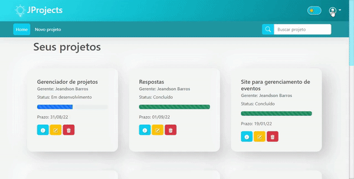

`python -m venv venv`
`venv\Scripts\activate`
`pip install Django`
`django-admin startproject django_project .`
`python manage.py startapp app_exemplo`
`python manage.py runserver`
`python manage.py makemigrations`
`python manage.py migrate`
`pip freeze > requirements.txt`
`pip install -r requirements.txt`

