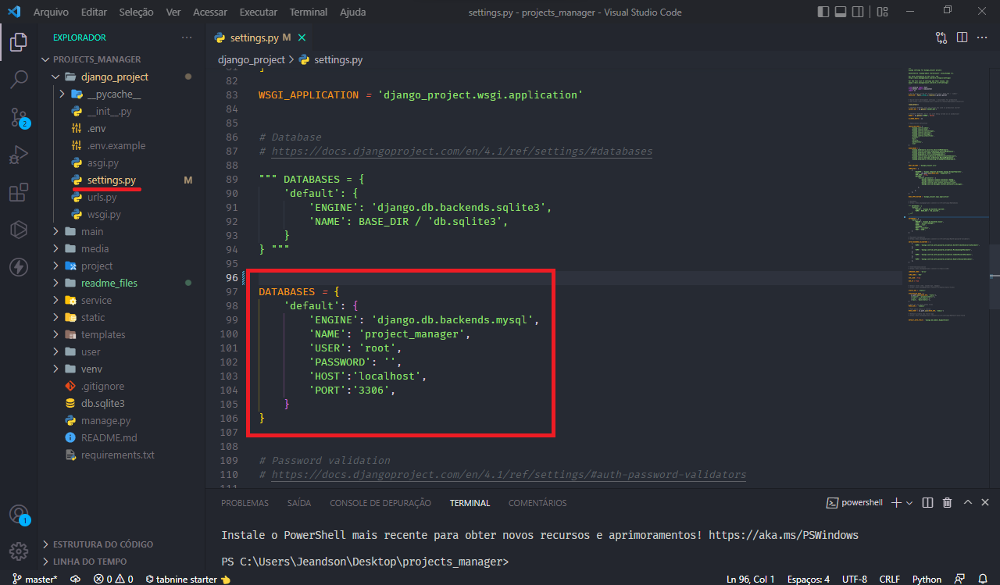
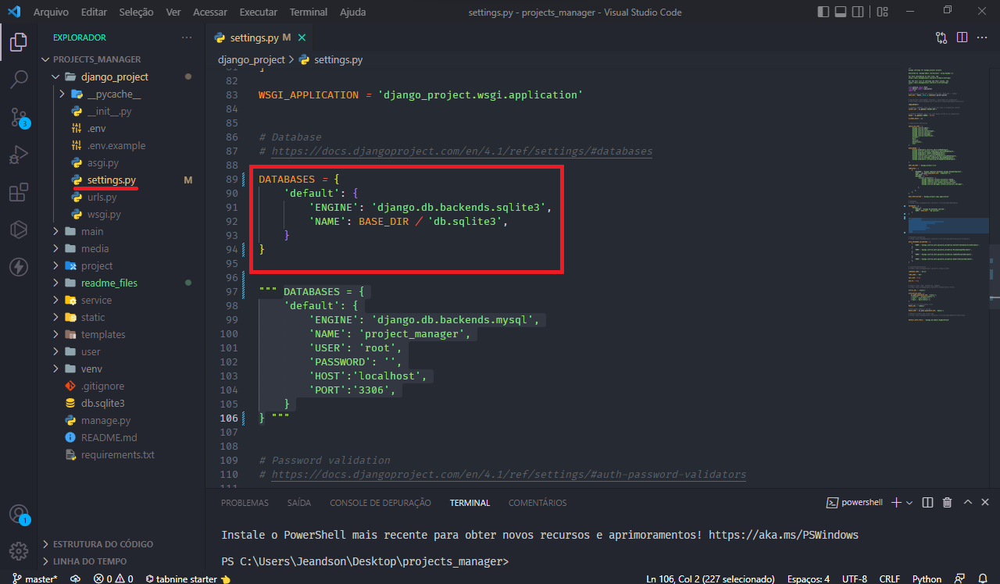

# Project Management with Django
Website for project management, developed with the Python Django web framework.

The website has the following features: 
[1. Project Management](#1-project-management) 
[2. Project Service Management](#2-project-service-management) 
[3. Authentication.](#3-authentication) 

## Execution
This project was developed using the venv virtual environment, I recommend that you do the same to exult the project, to reduce the chances of error.

### 1. Installation of dependencies
Run the command `pip install -r requirements.txt` in your shell to install the required dependencies.

### 2. Setting environment variables
Create an .env file in the /django_project folder and pass the following variables to it:
`SECRET_KEY=''`  
`DEBUG=True`

SECRET_KEY is the secret key used in production, keep it secret.
DEBUG is the variable responsible for defining whether the debug options will be active or not, I recommend that you leave it activated only in development.

If you want to see what the .env file should look like see the .env.example in /django_project/.env.example

### 3. Database configuration
The project was developed using MySQL, but you can also use SQLite or install and configure a database of your own.

#### - MySQL Database
If you want to use MySQL, create a database with the name project_manager and pass your database information to the DATABASES variable in /django_project/settings.py as shown in the following image:

Then run the following commands:  
`python manage.py makemigrations`  
`python manage.py migrate`

#### - SQLite Database
If you want to use SQLite, uncomment the variable with the SQLite settings and comment out the MySQL settings in /django_project/settings.py as shown in the following image:

Then run the following commands:  
`python manage.py makemigrations`  
`python manage.py migrate`

### 4. Run server
If the previous steps were successful, just run the command `python manage.py runserver` and open the URL http://127.0.0.1:8000/ in your browser.

## Website features

### 1. Project Management
- Project registration.
- Editing projects.
- Deleting projects.
- Search by projects.
- Listing of authenticated user projects.

### 2. Project Service Management
- Register service for the project.
- Edit the registered service.
- Delete service.
- Lists of projects services.
- Search for specific service.
- Check if the price of the service is within the budget.

### 3. Authentication
- User login
- User registration
- Editing user data
- User account deletion

